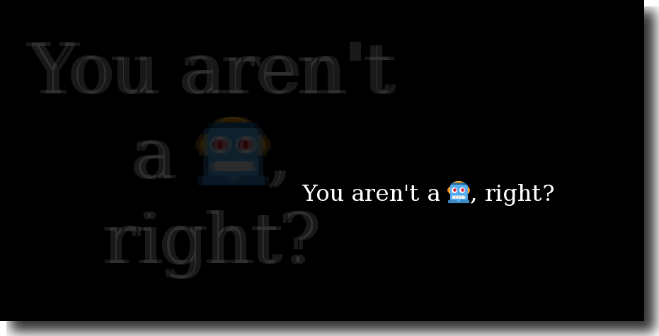
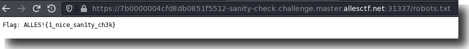

# Sanity Check

Writeup by: [GoProSlowYo](https://github.com/GoProSlowYo)

Team: [OnlyFeet](https://ctftime.org/team/144644)

Writeup URL: [GitHub](https://infosecstreams.github.io/allesctf2021/sanitycheck/)

----

```text
You aren't a 🤖, right?
```

## Are you...

This is essentially the `README.md` of CTFs. Let's launch the challenge and look for the strongly hinted-at `robots.txt` file.



Let's check for a robots.txt...

## A Robots.txt?



## Victory

Submit the flag and claim the points:

**ALLES!{1_nice_san1ty_ch3k}**
